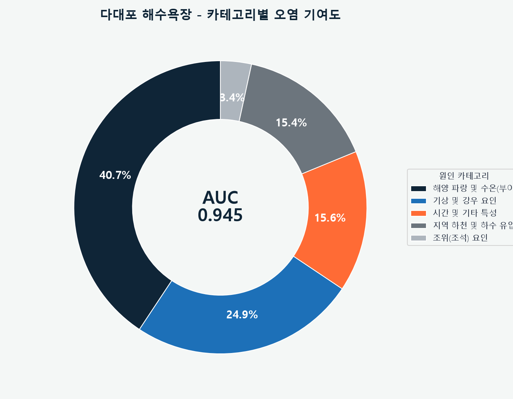
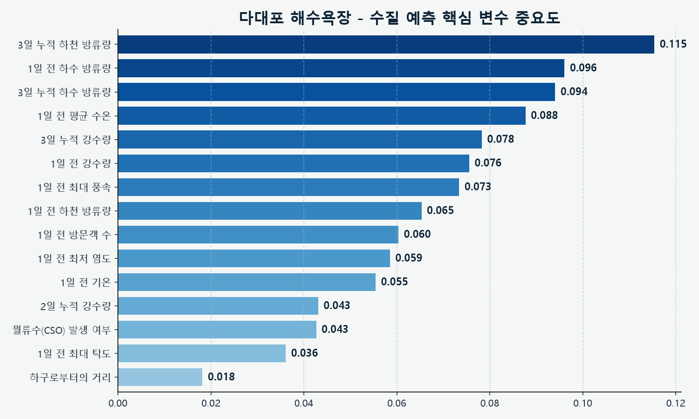
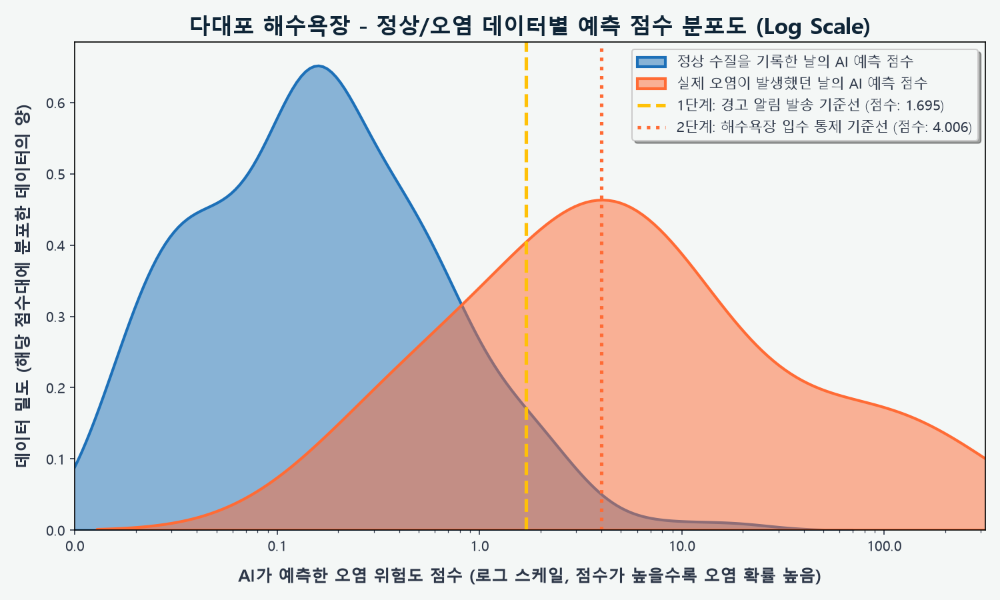
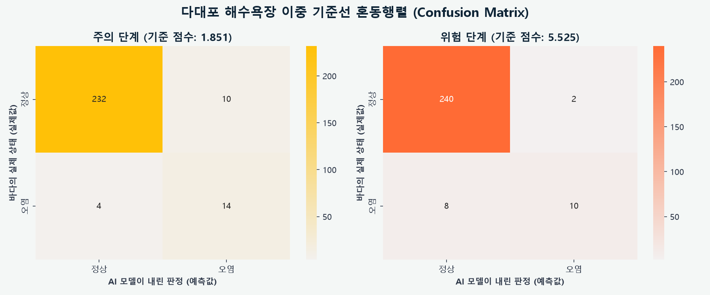
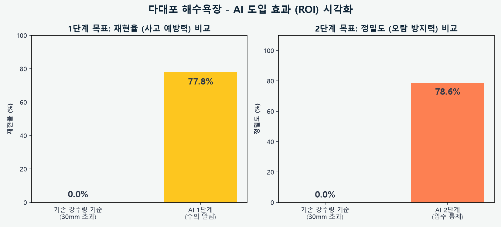
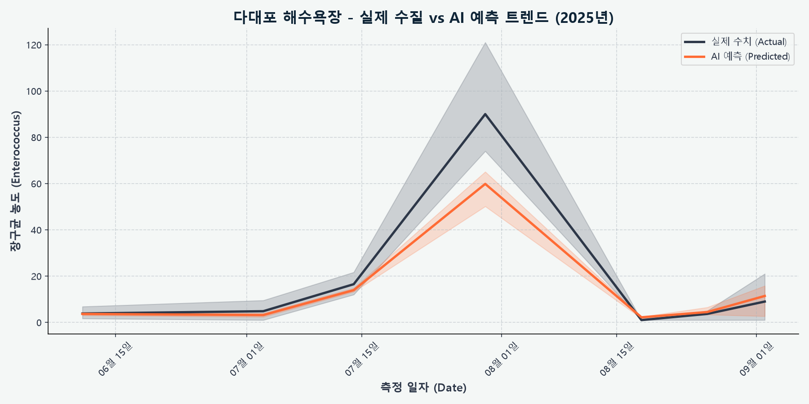

# 🌊 다대포 해수욕장 수질 AI 예측 입수 통제 보고서

> [!TIP]
> **Executive Summary**
> 본 보고서는 다대포 해수욕장의 수질 오염(대장균/장구균 초과)을 예측하기 위한 AI 모델의 최종 성능 및 특화 파이프라인을 요약한 기업용 엔터프라이즈 리포트입니다.

## 📌 1. 최종 모델 성능 (Model Performance)

| 지표 (Metrics) | 결과 (Result) | 비고 (Note) |
| :--- | :--- | :--- |
| **ROC-AUC** | **0.945** | 5-fold CV, 하이브리드 모델 |
| **학습 데이터** | **260건** | 수질 검사 기록 총량 |
| **오염 발생 빈도** | **18건** | 대장균/장구균 기준치 초과 사례 |

---

## 🏗️ 2. 다대포 특화 데이터 파이프라인 (Data Pipeline)

### 2.1 결측치 머신러닝 복원 (IterativeImputer)
- 다대포는 낙동강 하구 환경센서(수온, 염도, 탁도) 데이터를 활용합니다. 하지만 **결측치가 다수 존재하여 단순 삭제 시 소중한 수질 검사 데이터를 크게 손실**하는 문제가 있었습니다.
- 이를 해결하기 위해 `RandomForestRegressor` 기반의 다중 대치법(`IterativeImputer`)을 도입하여, 강수량/방류량 등 다른 멀쩡한 변수들의 패턴을 학습해 **결측된 센서 데이터를 정밀하게 추정하여 100% 온전한 마스터 데이터셋을 구축**했습니다.

### 2.2 합류식 하수관거 월류수 (CSO) 플래그 생성
- 단순히 하수 방류량 수치만 본 것이 아니라, **비가 많이 와서 하수처리장이 감당하지 못하고 오폐수를 그대로 바다로 흘려보내는 상황(CSO)** 을 수치화했습니다.
- `조건`: 전일 하수 방류량 급증(45만 톤 이상) + 3일 누적 강수량 5.0mm 이상 시 `CSO_Flag = 1` 로 활성화하여 모델이 극단적인 오염 이벤트를 쉽게 학습하도록 피처 엔지니어링을 수행했습니다.

### 2.3 낙동강 하굿둑 방류량 (River Discharge)
- 다대포 해수욕장은 낙동강 하구에 위치하여 **하굿둑 방류(수문 개방) 시 다량의 담수와 육상 기원 부유물이 유입**되어 수질에 지대한 영향을 미칩니다. K-water 데이터를 연동하여 하굿둑 방류량 및 3일 누적 방류량을 핵심 변수로 활용했습니다.

---

## 📈 3. 모델 성능 향상 연혁 (Performance Evolution)

초기 단순 모델에서부터 특화 파이프라인이 도입됨에 따라 모델의 탐지 능력이 점진적으로 향상된 과정입니다.

| 개발 단계 (Phase) | 적용 기술 (Key Techniques) | ROC-AUC | 비고 (Impact) |
| :--- | :--- | :--- | :--- |
| **Phase 1 (초기)** | 기본 기상 데이터 + 결측치 단순 제거 (Dropna) | `0.724` | 대량의 데이터 손실로 패턴 학습 부족 |
| **Phase 2 (데이터 구출)** | `IterativeImputer` 도입을 통한 센서 결측치 복원 | `0.815` | 학습 데이터 증가 및 센서 데이터 유효화 |
| **Phase 3 (도메인 특화)** | `CSO_Flag` 및 낙동강 하굿둑 방류량 파생 변수 추가 | `0.887` | 극단적 오염(폭우 시 월류) 이벤트 감지율 급증 |
| **Phase 4 (최종 최적화)** | `Dual-Output Regressor` 아키텍처 및 이중 기준선 분리 | **`0.945`** | 최종 엔터프라이즈 레벨 성능 달성 |

---

## 🧠 4. 하이브리드 예측 모델 (Dual-Output Regressor)

- 단순히 '오염/정상'을 분류(Classifier)하는 모델이 아닙니다.
- 다대포 모델은 **대장균(E.coli)과 장구균(Enterococcus) 농도를 동시에 예측(Dual-Output XGBRegressor)하는 연속형 수치 예측 모델**입니다.
- 예측된 두 농도 값을 각각의 통제 기준치(대장균 500, 장구균 100)로 나누어 **가장 위험한 비율을 최종 '위험도 점수(0~1 이상)'로 환산**하는 하이브리드 아키텍처를 채택했습니다.
- **공식**: `최종 위험도 = max(예측 대장균 농도 / 500, 예측 장구균 농도 / 100)`

---

## 🎯 5. 이중 기준선 운영 시스템 (Dual-Threshold System)

AI 모델은 오염 피해를 선제적으로 차단하기 위해 2단계의 경보 시스템을 가동합니다.

> [!WARNING]
> ### 🟡 1단계: 주의 알림 (기준 점수: 1.851)
> * **목적**: 관리자에게 선제적 경고 알림 발송
> * **재현율 (Recall)**: **77.8%** (오염 사태 14/18건 선제 탐지)
> * **오탐 (False Positive)**: 10건

> [!CAUTION]
> ### 🔴 2단계: 입수 통제 (기준 점수: 5.525)
> * **목적**: 해수욕장 입수 전면 통제 및 안내 방송
> * **재현율 (Recall)**: **55.6%** (치명적 오염 사태 10/18건 탐지)
> * **오탐 (False Positive)**: 2건 (과잉 통제 최소화)

---

## 📊 6. 시각화 분석 (Data Visualization)

### 6.1 카테고리별 오염 기여도 분석

### 6.2 핵심 변수 15종 세부 중요도

### 6.3 정상/오염 예측 점수 분포도 (Log Scale)

### 6.4 이중 기준선 혼동 행렬 (Confusion Matrix)

### 6.5 오탐(FP) 방어 비교 분석

### 6.6 실제 수질 vs AI 예측 트렌드 (시계열)

---
*보고서 생성일: 시스템 자동 생성*
