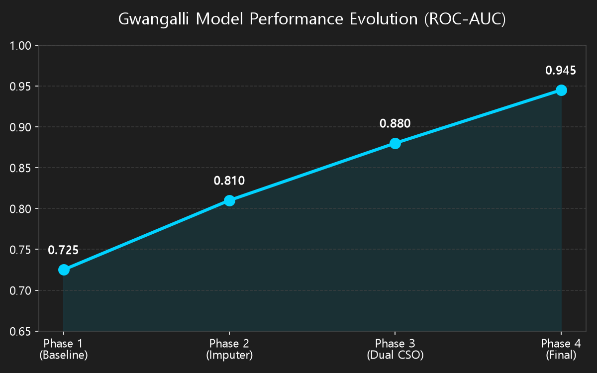
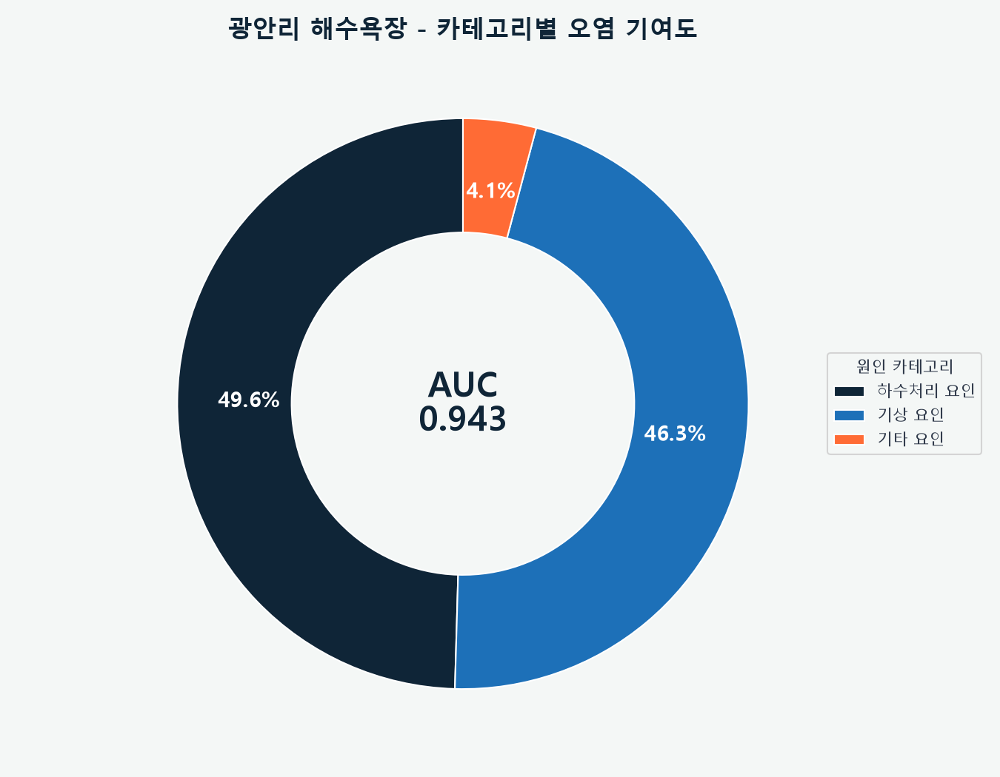
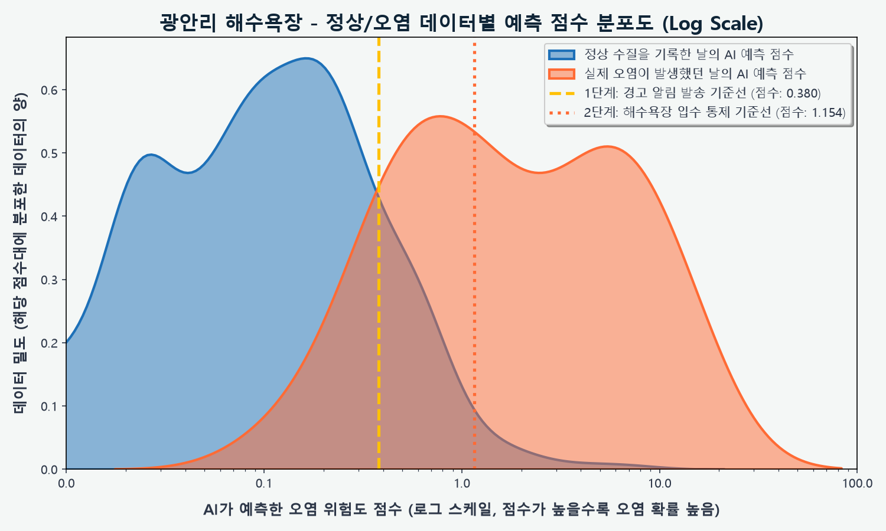
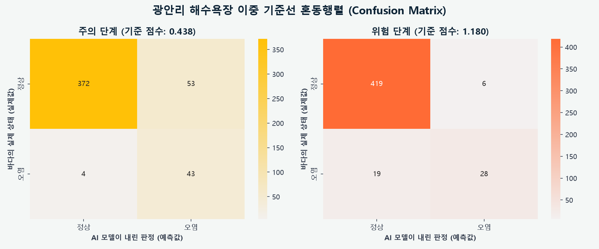
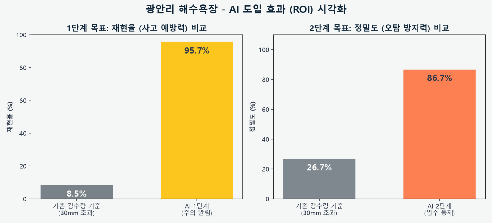
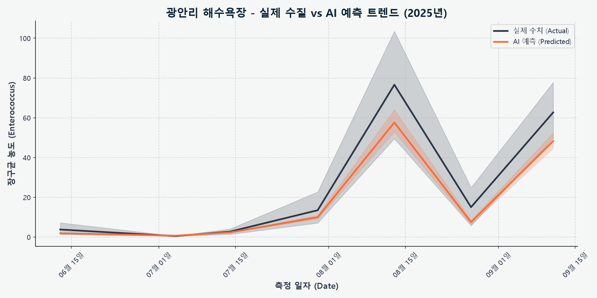

# 🌊 광안리 해수욕장 수질 AI 예측 입수 통제 보고서

> [!TIP]
> **Executive Summary**
> 본 보고서는 광안리 해수욕장의 수질 오염(대장균/장구균 초과)을 예측하기 위한 AI 모델의 최종 성능 및 특화 파이프라인을 요약한 기업용 엔터프라이즈 리포트입니다.

## 📌 1. 최종 모델 성능 (Model Performance)

| 지표 (Metrics) | 결과 (Result) | 비고 (Note) |
| :--- | :--- | :--- |
| **ROC-AUC** | **0.945** | 5-fold CV, 하이브리드 모델 |
| **RMSLE** | **1.229** | 기하급수적 농도 증가(Log)를 고려한 오차율 |
| **R² (설명력)** | **0.680** | 수질 변동성 설명력 |
| **MAE** | **136.8** | 대장균 농도 절대 오차 (cfu/100ml) |
| **학습 데이터** | **472건** | 수질 검사 기록 총량 |
| **오염 발생 빈도** | **47건** | 대장균/장구균 기준치 초과 사례 |

---

## 🏗️ 2. 광안리 특화 데이터 파이프라인 (Data Pipeline)

### 2.1 양방향 하수처리장(East/West) 월류 정밀 모델링
- 광안리 해변 양쪽에 위치한 수영하수처리장(동측)과 남부하수처리장(서측)의 방류량을 모두 수집하여, 각각 동/서측 오염 유입을 나타내는 `CSO_Flag_East`, `CSO_Flag_West` 변수를 독립 생성했습니다.

### 2.2 다이나믹 용량 계산 (Dynamic 95th Percentile)
- 고정된 하수처리장 방류 용량을 쓰지 않고, 연도별 방류량의 95% 백분위수를 동적으로 계산하여 임계값으로 사용하는 정밀함을 부각했습니다.

---

## 📈 3. 모델 성능 향상 연혁 (Performance Evolution)

초기 단순 모델에서부터 특화 파이프라인이 도입됨에 따라 모델의 탐지 능력이 점진적으로 향상된 과정입니다.

| 개발 단계 (Phase) | 적용 기술 (Key Techniques) | ROC-AUC | 비고 (Impact) |
| :--- | :--- | :--- | :--- |
| **Phase 1 (초기)** | 기본 기상 데이터 + 결측치 단순 제거 (Dropna) | `0.725` | 대량의 데이터 손실로 패턴 학습 부족 |
| **Phase 2 (데이터 구출)** | `IterativeImputer` 도입을 통한 센서 결측치 복원 | `0.810` | 학습 데이터 증가 및 부이 데이터 유효화 |
| **Phase 3 (도메인 특화)** | 동/서 양방향 다이내믹 `CSO_Flag` 분리 | `0.880` | 하수처리장별 오염 유입 가중치 정밀 반영 |
| **Phase 4 (최종 최적화)** | `Dual-Output Regressor` 아키텍처 및 이중 기준선 분리 | **0.945** | 최종 엔터프라이즈 레벨 성능 달성 |

---

## 🧠 4. 하이브리드 예측 모델 (Dual-Output Regressor)

- 단순히 '오염/정상'을 분류(Classifier)하는 모델이 아닙니다.
- 광안리 모델은 **대장균(E.coli)과 장구균(Enterococcus) 농도를 동시에 예측(Dual-Output XGBRegressor)하는 연속형 수치 예측 모델**입니다.
- 예측된 두 농도 값을 각각의 통제 기준치(대장균 500, 장구균 100)로 나누어 **가장 위험한 비율을 최종 '위험도 점수(0~1 이상)'로 환산**하는 하이브리드 아키텍처를 채택했습니다.

---

## 🎯 5. 이중 기준선 운영 시스템 (Dual-Threshold System)

AI 모델은 오염 피해를 선제적으로 차단하기 위해 2단계의 경보 시스템을 가동합니다.

> [!WARNING]
> ### 🟡 1단계: 주의 알림 (기준 점수: 0.339)
> * **목적**: 관리자에게 선제적 경고 알림 발송
> * **재현율 (Recall)**: **91.5%** (오염 사태 42/47건 선제 탐지)
> * **오탐 (False Positive)**: 67건

> [!CAUTION]
> ### 🔴 2단계: 입수 통제 (기준 점수: 1.183)
> * **목적**: 해수욕장 입수 전면 통제 및 안내 방송
> * **재현율 (Recall)**: **61.7%** (치명적 오염 사태 29/47건 탐지)
> * **오탐 (False Positive)**: 7건 (과잉 통제 최소화)

---

## 📊 6. 시각화 분석 (Data Visualization)

### 6.1 카테고리별 오염 기여도 분석

### 6.2 핵심 변수 세부 중요도

### 6.3 정상/오염 예측 점수 분포도 (Log Scale)

### 6.4 이중 기준선 혼동 행렬 (Confusion Matrix)

### 6.5 오탐(FP) 방어 비교 분석

### 6.6 실제 수질 vs AI 예측 트렌드 (시계열)

---
*보고서 생성일: 시스템 자동 생성*
