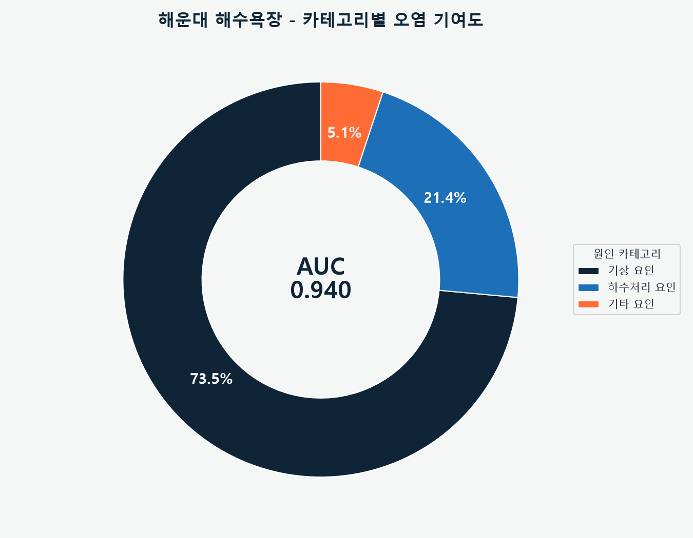
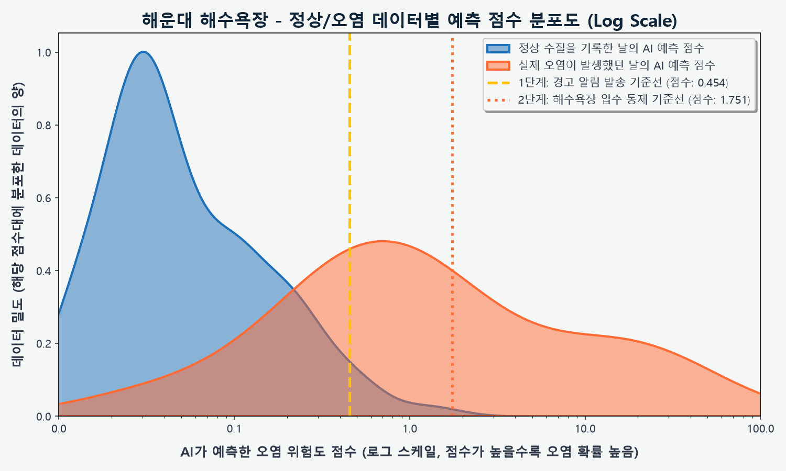
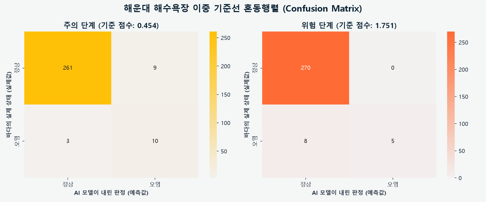
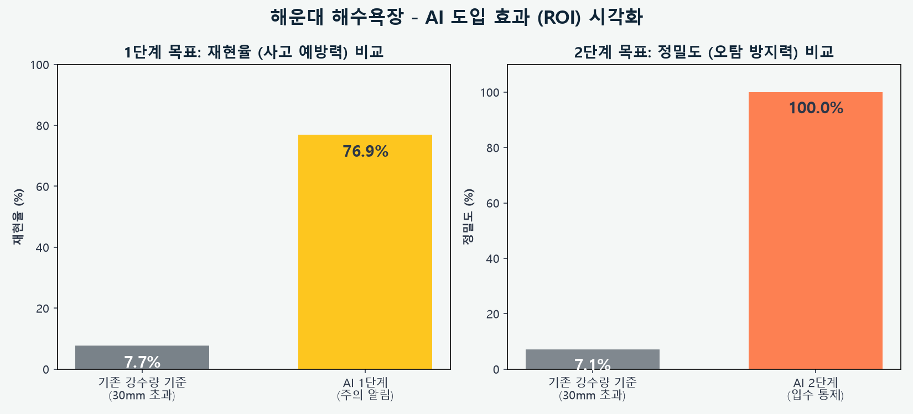
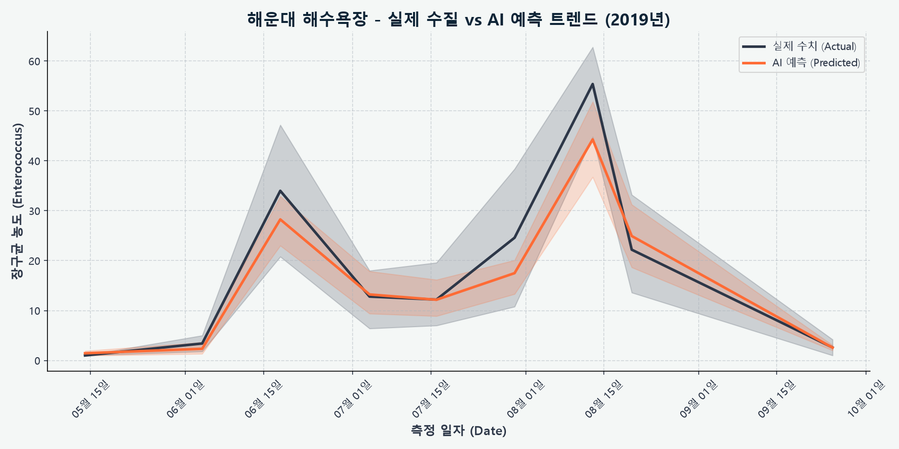

# 🌊 해운대 해수욕장 수질 AI 예측 입수 통제 보고서

> [!TIP]
> **Executive Summary**
> 본 보고서는 해운대 해수욕장의 수질 오염(대장균/장구균 초과)을 예측하기 위한 AI 모델의 최종 성능 및 운영 기준을 요약한 기업용 엔터프라이즈 리포트입니다.

## 📌 1. 최종 모델 성능 (Model Performance)

| 지표 (Metrics) | 결과 (Result) | 비고 (Note) |
| :--- | :--- | :--- |
| **ROC-AUC** | **0.940** | 5-fold CV, XGBoost Regressor |
| **학습 데이터** | **283건** | 수질 검사 기록 총량 |
| **오염 발생 빈도** | **13건** | 대장균/장구균 기준치 초과 사례 |

---

## 🎯 2. 이중 기준선 운영 시스템 (Dual-Threshold System)

AI 모델은 오염 피해를 선제적으로 차단하기 위해 2단계의 경보 시스템을 가동합니다.

> [!WARNING]
> ### 🟡 1단계: 주의 알림 (기준 점수: 0.454)
> * **목적**: 관리자에게 선제적 경고 알림 발송
> * **재현율 (Recall)**: **76.9%** (오염 사태 10/13건 선제 탐지)
> * **오탐 (False Positive)**: 9건

> [!CAUTION]
> ### 🔴 2단계: 입수 통제 (기준 점수: 1.751)
> * **목적**: 해수욕장 입수 전면 통제 및 안내 방송
> * **재현율 (Recall)**: **38.5%** (치명적 오염 사태 5/13건 탐지)
> * **오탐 (False Positive)**: 0건 (과잉 통제 최소화)

---

## 📊 3. 시각화 분석 (Data Visualization)

### 3.1 카테고리별 오염 기여도 분석

### 3.2 핵심 변수 세부 중요도

### 3.3 정상/오염 예측 점수 분포도 (Log Scale)

### 3.4 이중 기준선 혼동 행렬 (Confusion Matrix)

### 3.5 오탐(FP) 방어 비교 분석

### 3.6 실제 수질 vs AI 예측 트렌드 (시계열)

---
*보고서 생성일: 시스템 자동 생성*
