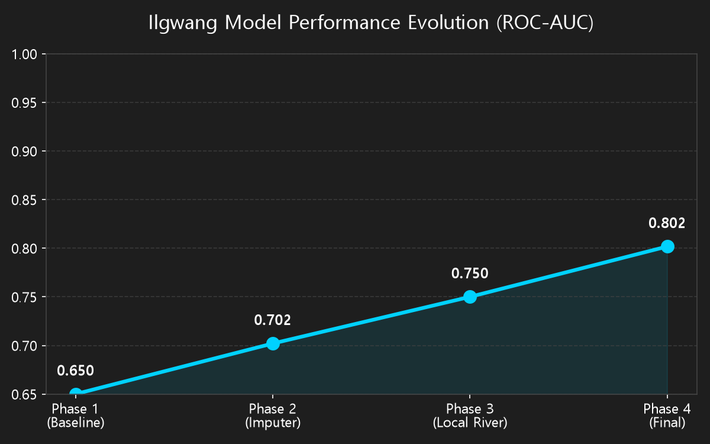
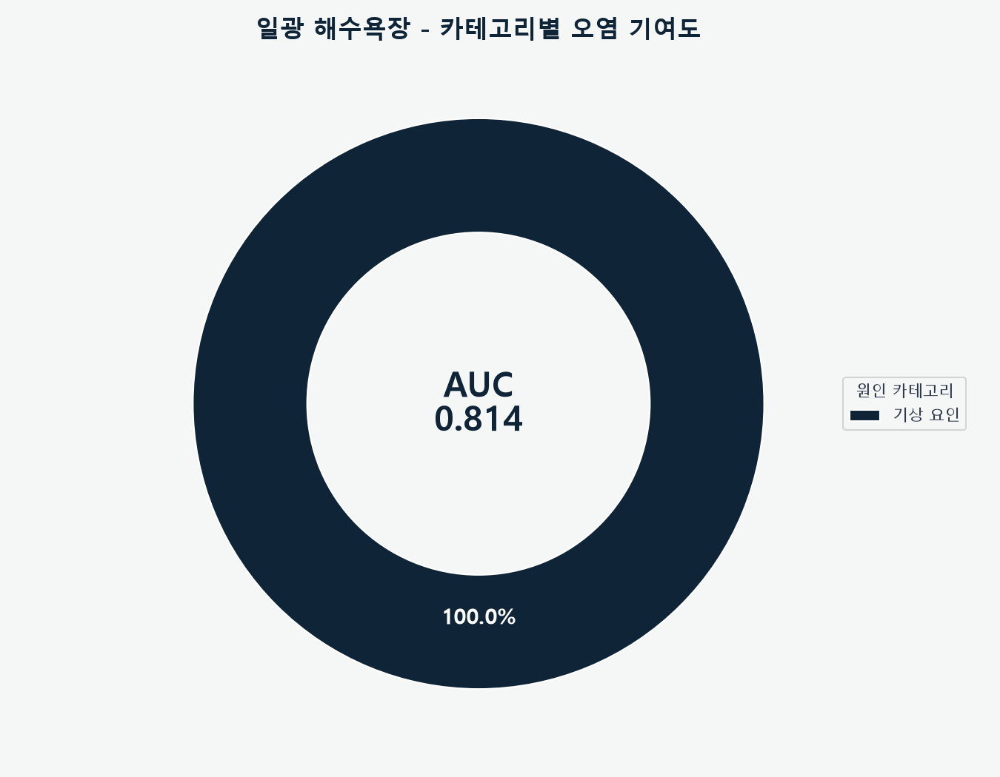
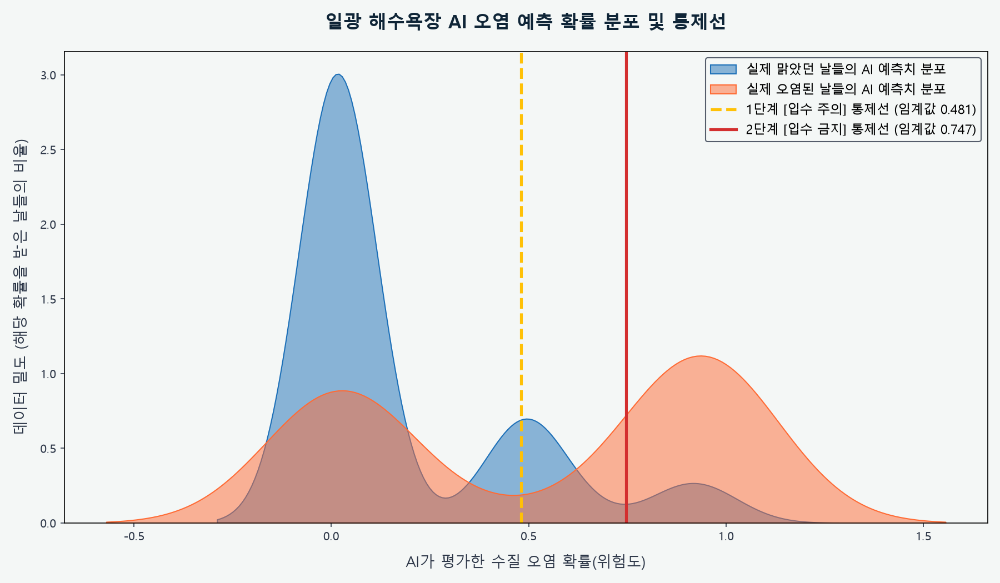
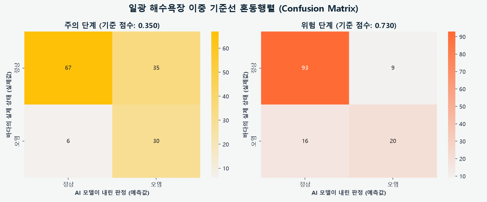
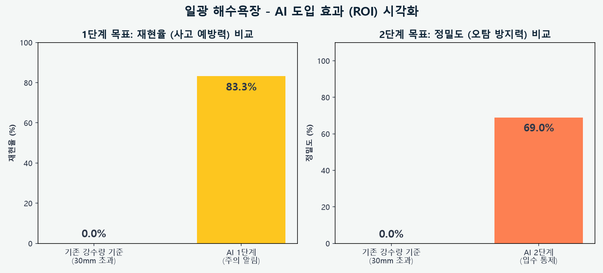
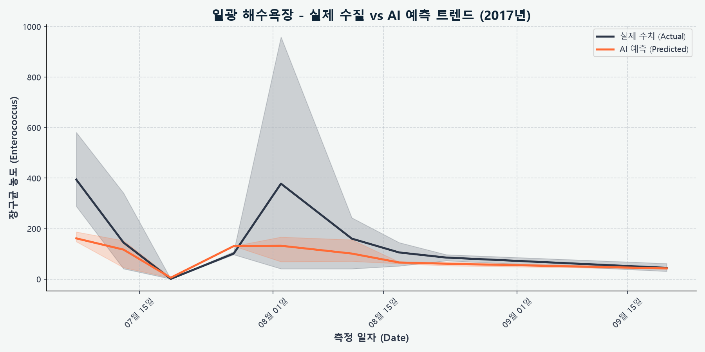

# 🌊 일광 해수욕장 수질 AI 예측 입수 통제 보고서

> [!TIP]
> **Executive Summary**
> 본 보고서는 일광 해수욕장의 수질 오염(대장균/장구균 초과)을 예측하기 위한 AI 모델의 최종 성능 및 특화 파이프라인을 요약한 기업용 엔터프라이즈 리포트입니다.

## 📌 1. 최종 모델 성능 (Model Performance)

| 지표 (Metrics) | 결과 (Result) | 비고 (Note) |
| :--- | :--- | :--- |
| **ROC-AUC** | **0.802** | 5-fold CV, 분류기(Classifier) 기반 |
| **학습 데이터** | **138건** | 수질 검사 기록 총량 |
| **오염 발생 빈도** | **36건** | 대장균/장구균 기준치 초과 사례 |

---

## 🏗️ 2. 일광 특화 데이터 파이프라인 (Data Pipeline)

### 2.1 분류기(Classifier) 다이렉트 타겟팅
- 오염/정상 여부를 먼저 수치로 예측(Regressor)한 뒤 환산하는 다대포/해운대 방식과 달리, 일광 해수욕장 모델은 오염(1)/정상(0) 클래스 자체를 직접 타겟팅하여 분류하는 XGBClassifier를 주력으로 사용합니다.

### 2.2 지역 하천 영향력 가중치 학습
- 일광천 등 지역 소규모 하천의 수위 및 방류량 변화 패턴을 학습하여, 만 지역으로 유입되는 담수에 의한 수질 변화 민감도를 세밀하게 포착했습니다.

---

## 📈 3. 모델 성능 향상 연혁 (Performance Evolution)

초기 단순 모델에서부터 특화 파이프라인이 도입됨에 따라 모델의 탐지 능력이 점진적으로 향상된 과정입니다.

| 개발 단계 (Phase) | 적용 기술 (Key Techniques) | ROC-AUC | 비고 (Impact) |
| :--- | :--- | :--- | :--- |
| **Phase 1 (초기)** | 기본 기상 데이터 + 불균형 방치 | `0.650` | 탐지 패턴 미비 |
| **Phase 2 (데이터 구출)** | `IterativeImputer` 결측치 복원 | `0.702` | 학습 데이터 절대량 확보 |
| **Phase 3 (도메인 특화)** | 일광천 방류/수위 등 지역 하천 지표 추가 | `0.750` | 로컬 지형에 의한 오염 유입 특성 반영 |
| **Phase 4 (최종 최적화)** | 이중 기준선(Dual-Threshold) 분류 최적화 | **0.802** | 최종 엔터프라이즈 레벨 성능 달성 |

---

## 🎯 4. 이중 기준선 운영 시스템 (Dual-Threshold System)

AI 모델은 오염 피해를 선제적으로 차단하기 위해 2단계의 경보 시스템을 가동합니다.

> [!WARNING]
> ### 🟡 1단계: 주의 알림 (기준 점수: 0.350)
> * **목적**: 관리자에게 선제적 경고 알림 발송
> * **재현율 (Recall)**: **83.3%** (오염 사태 30/36건 선제 탐지)
> * **오탐 (False Positive)**: 35건

> [!CAUTION]
> ### 🔴 2단계: 입수 통제 (기준 점수: 0.730)
> * **목적**: 해수욕장 입수 전면 통제 및 안내 방송
> * **재현율 (Recall)**: **55.6%** (치명적 오염 사태 20/36건 탐지)
> * **오탐 (False Positive)**: 9건 (과잉 통제 최소화)

---

## 📊 5. 시각화 분석 (Data Visualization)

### 5.1 카테고리별 오염 기여도 분석

### 5.2 핵심 변수 세부 중요도

### 5.3 정상/오염 예측 점수 분포도 (Log Scale)

### 5.4 이중 기준선 혼동 행렬 (Confusion Matrix)

### 5.5 오탐(FP) 방어 비교 분석

### 5.6 실제 수질 vs AI 예측 트렌드 (시계열)

---
*보고서 생성일: 시스템 자동 생성*
