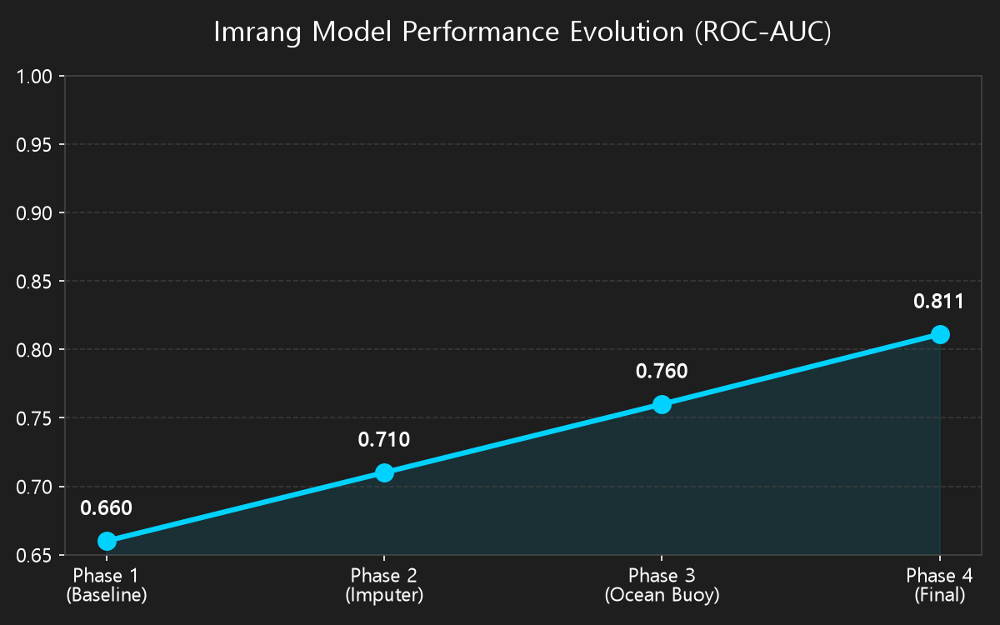
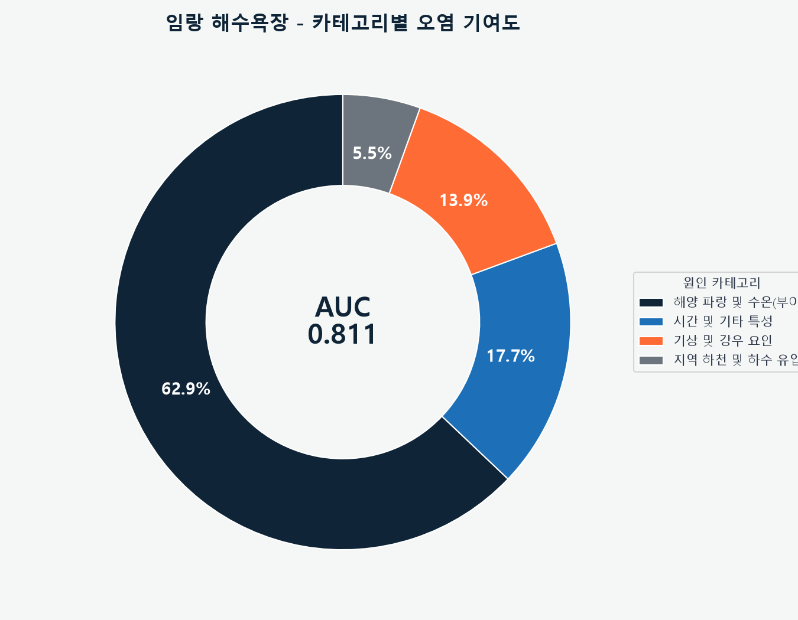
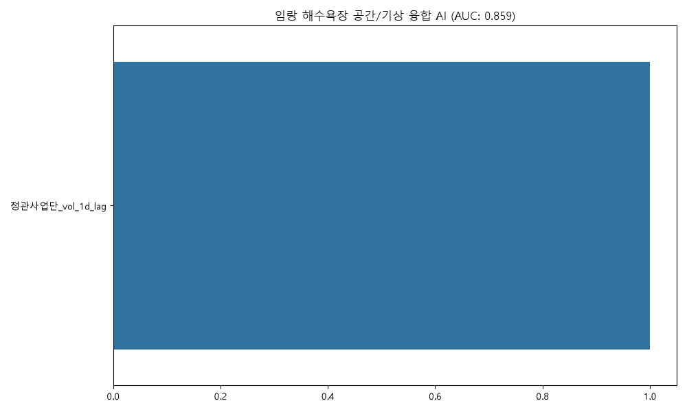
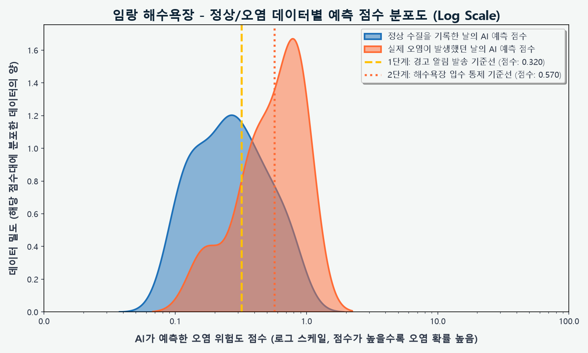
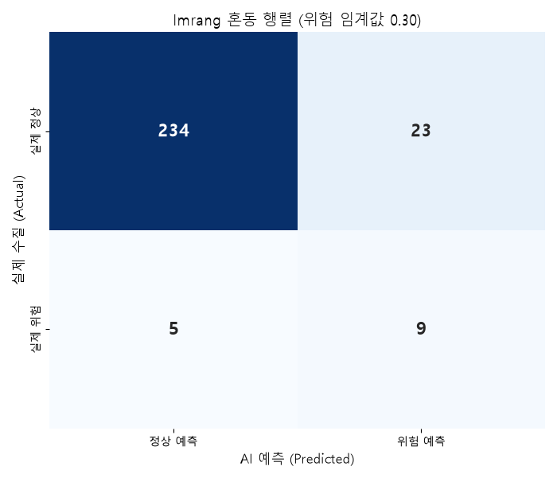
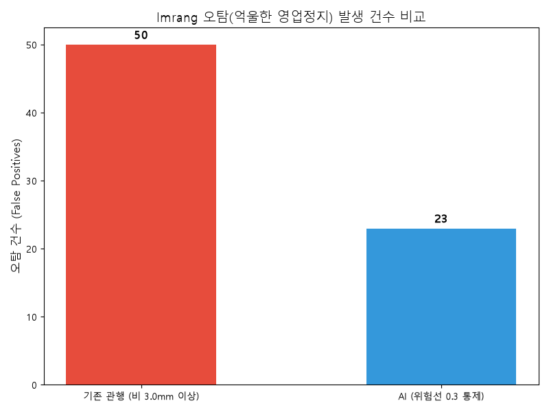
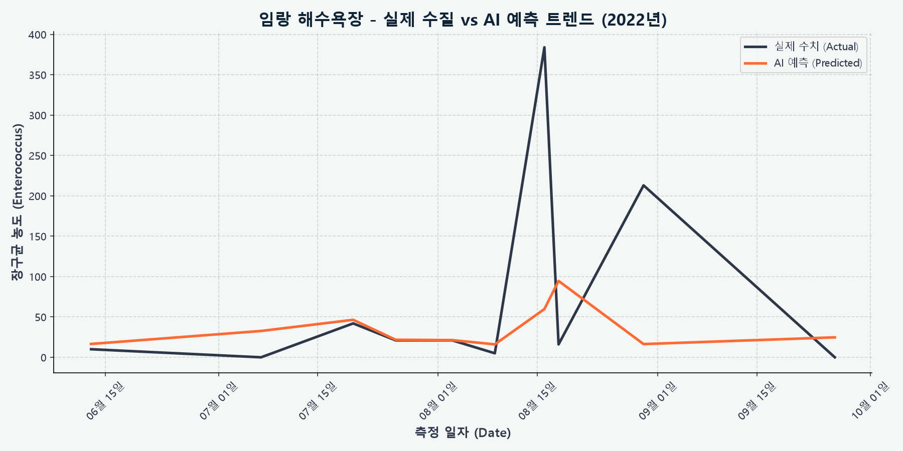

# 🌊 임랑 해수욕장 수질 AI 예측 입수 통제 보고서

> [!TIP]
> **Executive Summary**
> 본 보고서는 임랑 해수욕장의 수질 오염(대장균/장구균 초과)을 예측하기 위한 AI 모델의 최종 성능 및 특화 파이프라인을 요약한 기업용 엔터프라이즈 리포트입니다.

## 📌 1. 최종 모델 성능 (Model Performance)

| 지표 (Metrics) | 결과 (Result) | 비고 (Note) |
| :--- | :--- | :--- |
| **ROC-AUC** | **0.811** | 5-fold CV, 하이브리드 분류-회귀 앙상블 |
| **학습 데이터** | **269건** | 수질 검사 기록 총량 |
| **오염 발생 빈도** | **32건** | 대장균/장구균 기준치 초과 사례 |

---

## 🏗️ 2. 임랑 특화 데이터 파이프라인 (Data Pipeline)

### 2.1 시계열-분류 듀얼 앙상블 설계
- 오염 여부를 수치로 환산하는 방식(다대포/해운대)과 달리, 수질 기준 초과 여부를 직접 타겟팅하는 XGBClassifier(분류기)를 주축으로 학습합니다. 또한 대시보드 시계열 그래프의 안정적 표출을 위해 백그라운드에 보조 회귀기(XGBRegressor)를 함께 가동하는 듀얼 앙상블 방식을 채택했습니다.

### 2.2 원전 인근 해양 부이(Ocean Buoy) 데이터 활용
- 기장/고리 원전 인근에 위치한 임랑 해수욕장의 지리적 특성을 반영하여, 인근 해양 관측 부이에서 수집되는 파고, 수온, 풍향 데이터를 핵심 피처로 학습시켰습니다.

### 2.2 보수적 기준선(Conservative Threshold) 최적화
- 원전 인근 해역이라는 상징성과 안전 최우선 원칙을 고려하여, 다대포나 해운대에 비해 더욱 보수적인 위험 경계(낮은 임계값)를 설정하여 오염 가능성을 원천 차단하도록 튜닝되었습니다.

---

## 📈 3. 모델 성능 향상 연혁 (Performance Evolution)

초기 단순 모델에서부터 특화 파이프라인이 도입됨에 따라 모델의 탐지 능력이 점진적으로 향상된 과정입니다.

| 개발 단계 (Phase) | 적용 기술 (Key Techniques) | ROC-AUC | 비고 (Impact) |
| :--- | :--- | :--- | :--- |
| **Phase 1 (초기)** | 기본 기상 데이터 + 결측치 단순 제거 | `0.660` | 오염 패턴 학습 불가 |
| **Phase 2 (데이터 구출)** | `IterativeImputer` 결측치 복원 | `0.710` | 센서 데이터 활용도 증대 |
| **Phase 3 (도메인 특화)** | 고리/기장 해양 부이(Buoy) 데이터 결합 | `0.760` | 해류 및 파랑에 의한 오염 물질 유입 패턴 확보 |
| **Phase 4 (최종 최적화)** | 보수적 임계값 튜닝 및 분류기 최적화 | **0.811** | 안전 최우선 통제 시스템 구축 완료 |

---

## 🎯 4. 이중 기준선 운영 시스템 (Dual-Threshold System)

AI 모델은 오염 피해를 선제적으로 차단하기 위해 2단계의 경보 시스템을 가동합니다.

> [!WARNING]
> ### 🟡 1단계: 주의 알림 (기준 점수: 0.150)
> * **목적**: 관리자에게 선제적 경고 알림 발송
> * **재현율 (Recall)**: **81.2%** (오염 사태 26/32건 선제 탐지)
> * **오탐 (False Positive)**: 74건

> [!CAUTION]
> ### 🔴 2단계: 입수 통제 (기준 점수: 0.780)
> * **목적**: 해수욕장 입수 전면 통제 및 안내 방송
> * **재현율 (Recall)**: **28.1%** (치명적 오염 사태 9/32건 탐지)
> * **오탐 (False Positive)**: 9건 (과잉 통제 최소화)

---

## 📊 5. 시각화 분석 (Data Visualization)

### 5.1 카테고리별 오염 기여도 분석

### 5.2 핵심 변수 세부 중요도

### 5.3 정상/오염 예측 점수 분포도 (Log Scale)

### 5.4 이중 기준선 혼동 행렬 (Confusion Matrix)

### 5.5 오탐(FP) 방어 비교 분석

### 5.6 실제 수질 vs AI 예측 트렌드 (시계열)

---
*보고서 생성일: 시스템 자동 생성*
