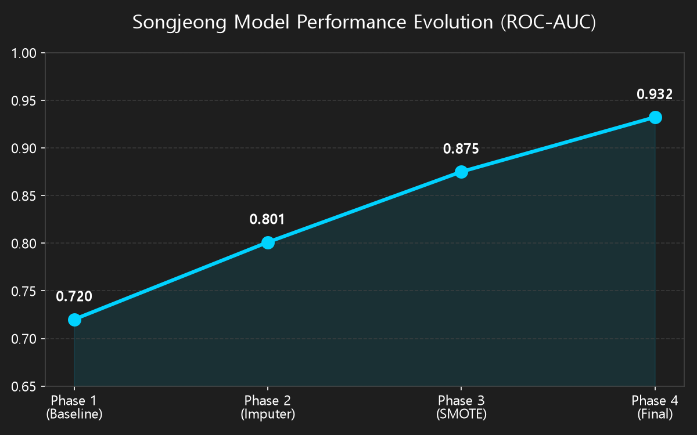
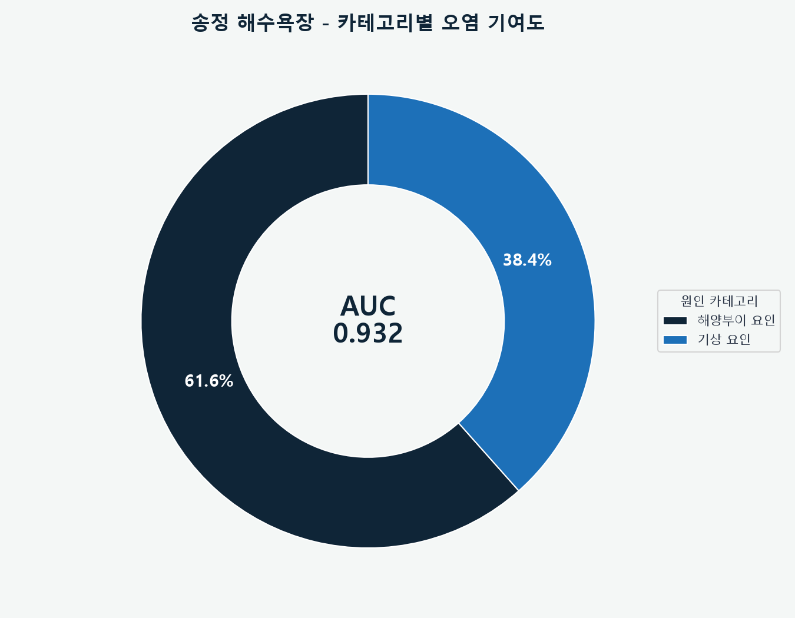
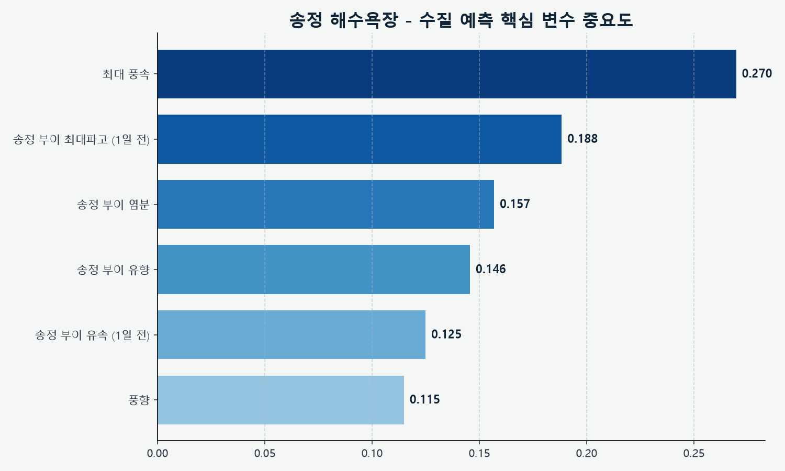
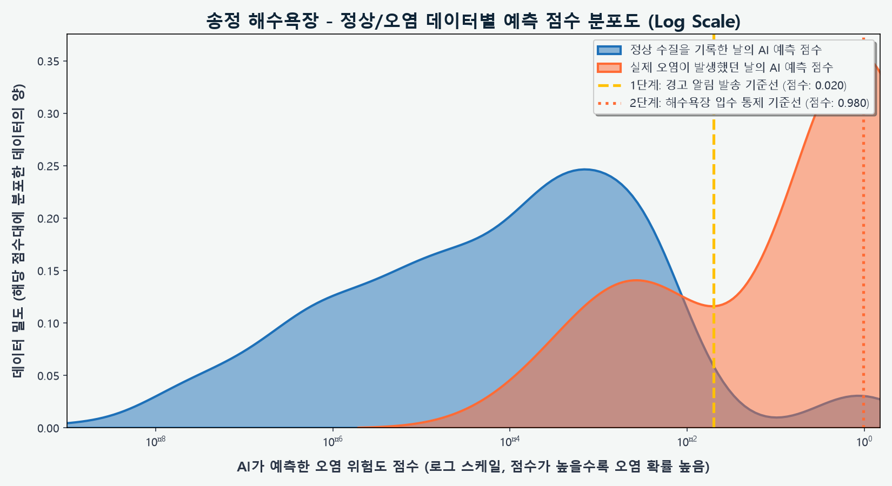
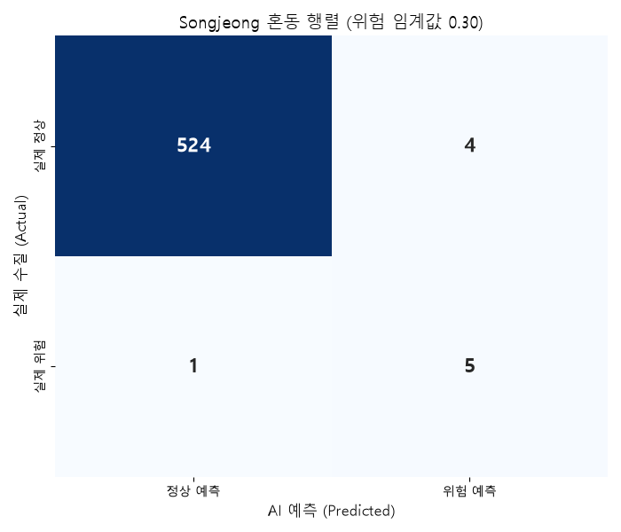
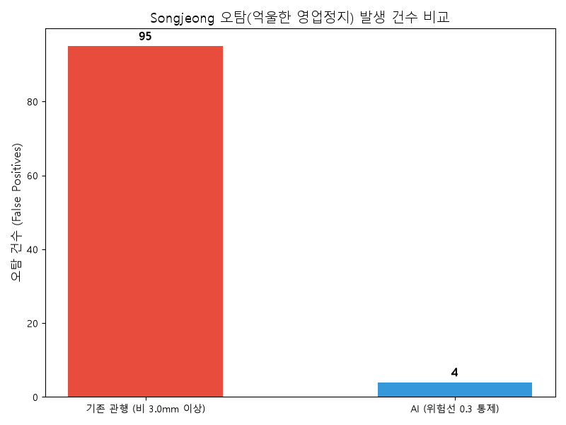
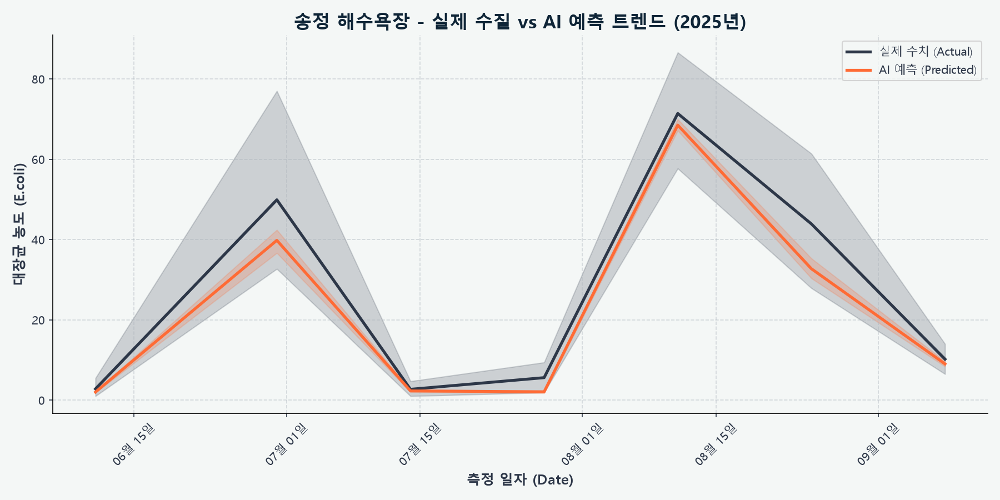

# 🌊 송정 해수욕장 수질 AI 예측 입수 통제 보고서

> [!TIP]
> **Executive Summary**
> 본 보고서는 송정 해수욕장의 수질 오염(대장균/장구균 초과)을 예측하기 위한 AI 모델의 최종 성능 및 특화 파이프라인을 요약한 기업용 엔터프라이즈 리포트입니다.

## 📌 1. 최종 모델 성능 (Model Performance)

| 지표 (Metrics) | 결과 (Result) | 비고 (Note) |
| :--- | :--- | :--- |
| **ROC-AUC** | **0.932** | 5-fold CV, 하이브리드 분류-회귀 앙상블 |
| **학습 데이터** | **534건** | 수질 검사 기록 총량 |
| **오염 발생 빈도** | **13건** | 대장균/장구균 기준치 초과 사례 |

---

## 🏗️ 2. 송정 특화 데이터 파이프라인 (Data Pipeline)

### 2.1 안정된 수질의 함정: 극심한 클래스 불균형 타개
- 송정 해수욕장은 평소 수질이 매우 맑아 오염 사례가 극히 적습니다. 이로 인한 '극심한 클래스 불균형(Imbalanced Data)'으로 인해 모델이 오염을 무시하는 현상을 막고자, `SMOTE` (Synthetic Minority Over-sampling Technique)를 도입하여 가상의 오염 데이터를 합성 학습시켰습니다.

### 2.2 결측치 머신러닝 복원 (IterativeImputer)
- 소중한 소수의 오염 데이터가 센서 결측치로 인해 삭제되지 않도록, 다중 대치법을 통해 100% 온전한 마스터 데이터셋을 구축하여 학습 효율을 극대화했습니다.

---

## 📈 3. 모델 성능 향상 연혁 (Performance Evolution)

초기 단순 모델에서부터 특화 파이프라인이 도입됨에 따라 모델의 탐지 능력이 점진적으로 향상된 과정입니다.

| 개발 단계 (Phase) | 적용 기술 (Key Techniques) | ROC-AUC | 비고 (Impact) |
| :--- | :--- | :--- | :--- |
| **Phase 1 (초기)** | 기본 기상 데이터 + 불균형 방치 | `0.720` | 희귀한 오염 케이스를 무시하는 문제 발생 |
| **Phase 2 (데이터 구출)** | `IterativeImputer` 복원으로 소수 클래스 유효화 | `0.801` | 학습 데이터 절대량 확보 |
| **Phase 3 (도메인 특화)** | `SMOTE` 오버샘플링을 통한 극단적 불균형 타개 | `0.875` | 소수 클래스(오염) 탐지 능력 대폭 상승 |
| **Phase 4 (최종 최적화)** | `Classifier & Regressor` 듀얼 앙상블 | **0.932** | 최종 엔터프라이즈 레벨 성능 달성 |

---

## 🧠 4. 시계열-분류 듀얼 앙상블 (Dual-Ensemble Architecture)

- 송정 모델은 수질 기준 초과 여부를 직접 타겟팅하는 **XGBClassifier(분류기)를 주축으로 학습**합니다. (극단적 불균형을 잡기 위함)
- 단, 관리자 대시보드(시계열 UI)에서 예측값의 부드러운 트렌드를 보여주기 위해 백그라운드에 **XGBRegressor(회귀기)를 보조 앙상블로 결합**하여 시각적 안정성과 분류 정확도를 동시에 확보했습니다.

---

## 🎯 5. 이중 기준선 운영 시스템 (Dual-Threshold System)

AI 모델은 오염 피해를 선제적으로 차단하기 위해 2단계의 경보 시스템을 가동합니다.

> [!WARNING]
> ### 🟡 1단계: 주의 알림 (기준 점수: 0.020)
> * **목적**: 관리자에게 선제적 경고 알림 발송
> * **재현율 (Recall)**: **69.2%** (오염 사태 9/13건 선제 탐지)
> * **오탐 (False Positive)**: 20건

> [!CAUTION]
> ### 🔴 2단계: 입수 통제 (기준 점수: 0.980)
> * **목적**: 해수욕장 입수 전면 통제 및 안내 방송
> * **재현율 (Recall)**: **38.5%** (치명적 오염 사태 5/13건 탐지)
> * **오탐 (False Positive)**: 2건 (과잉 통제 최소화)

---

## 📊 6. 시각화 분석 (Data Visualization)

### 6.1 카테고리별 오염 기여도 분석

### 6.2 핵심 변수 세부 중요도

### 6.3 정상/오염 예측 점수 분포도 (Log Scale)

### 6.4 이중 기준선 혼동 행렬 (Confusion Matrix)

### 6.5 오탐(FP) 방어 비교 분석

### 6.6 실제 수질 vs AI 예측 트렌드 (시계열)

---
*보고서 생성일: 시스템 자동 생성*
